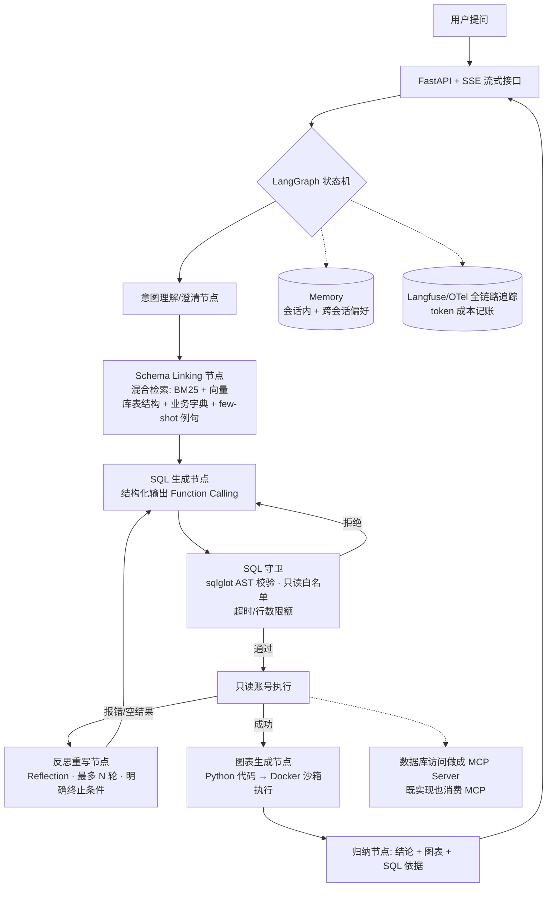

# 项目方案：企业数据分析 Agent（NL2SQL + 图表 + 报告的多智能体系统）

> 面向：校招 Agent 开发/大模型应用开发岗 · 主力语言 Python · 节奏：4 周先出可写上简历的完整闭环，之后滚动增强。
> 决策依据见 `docs/research.md`。

## 一、一句话定位

**让业务人员用自然语言查数：一个把"提问 → 选表 → 生成 SQL → 安全执行 → 自动纠错 → 出图表 → 给结论"做成完整闭环的多智能体系统，自带评测基准跑分、全链路追踪和成本记账。**

工作名：`insight-agent`（可自定，避免叫"智能客服/知识库问答"这类已被看腻的名字）。

## 二、为什么是这个方向（对照调研结论）

| 调研结论 | 本项目如何命中 |
|---|---|
| eval 设计是辨别真实经验的最佳信号 | NL2SQL 有 **BIRD/Spider 公开基准**，执行准确率（EX）可复现、可信，不依赖 LLM 主观判分 |
| NL2SQL Agent 是面试系统设计高频题（重点问 SQL 注入与权限） | 项目本身就是这道题的完整答案：只读权限、AST 校验、沙箱、超时限额 |
| 面试官要"业务痛点→技术方案→量化结果" | 业务叙事天然成立（取数需求排队/人肉写 SQL），量化结果就是准确率/延迟/成本数字 |
| 避开智能客服/基础 RAG/通用助手红海 | 不在烂大街清单里；RAG 用在 Schema/业务字典检索上，是"RAG 为 Agent 服务"的进阶用法 |
| JD 关键词：LangGraph、Multi-Agent、Function Calling、MCP、Memory、沙箱、FastAPI/Docker | 全部覆盖（见架构） |

## 三、系统架构

关键设计点（每一个都是面试追问的弹药）：

1. **确定性编排**：可靠性放在 LangGraph 编排层（守卫节点、重试上限、终止条件），不放在 prompt 里——对应"生产级 vs demo 级"的行业共识。
2. **SQL 守卫**：数据库只读账号 + `sqlglot` 解析 AST 只放行 SELECT + 表白名单 + 超时/返回行数限额——回答"为什么不直接让模型生成脚本执行"。
3. **自纠错闭环**：执行报错/空结果 → 携带错误信息反思重写，限定 N 轮，防死循环——回答"终止条件怎么设计"。
4. **Schema RAG**：大库场景下不能把全部建表语句塞进 prompt，用混合检索（BM25+向量）选表选列 + 业务字典（"GMV=…"）+ 相似问句 few-shot——这是 RAG 的进阶用法，且消融实验能出数字。
5. **图表沙箱**：模型生成 matplotlib/plotly 代码，在无网络、限资源的 Docker 容器里执行——覆盖"代码解释器沙箱"系统设计题。
6. **MCP**：把数据库访问封装成自研 MCP server，agent 作为 MCP client 消费——一举覆盖"MCP 与 Function Calling 区别"考点。
7. **模型路由**：简单查询走便宜小模型、复杂查询走强模型，配缓存——能报出"单次调用成本 $0.0X"这个杀手级问题的答案。
8. **手写 ReAct 内循环**：LangGraph 只管外层流程编排；SQL 修复/库表探索节点内部是**手写的 Reason-Act-Observe 工具调用循环**（不用 prebuilt 的 create_react_agent），带重复动作检测（连续 N 次生成相同 SQL → 注入"换排查方向"提示）和 token/金额预算熔断——海外 take-home 已出现"禁用框架手写 tool calling"的考法，这让你能讲清 agent loop 本身怎么写，而不只是会调框架。
9. **结论防幻觉校验**：归纳节点给出的每个数字自动与 SQL 执行结果精确比对，对不上就拒绝出稿并重写；评测报告输出"编造数字率"指标——数据分析场景里编数字是最致命的信任问题。
10. **结构化工具契约**：查询/沙箱工具统一返回 `{ok, content(截断分页), truncated, next_offset, error_kind}`，错误分类（超时/权限/语法错/空结果），自纠错节点按错误类型走不同重写策略；铁律：输出必须截断分页、错误必须结构化、绝不拼字符串执行。

## 四、技术栈

- **语言/环境**：Python 3.12 + uv
- **编排**：LangGraph（生产采用最广，JD 点名最多）
- **模型**：OpenAI 兼容接口可切换——建议主用 DeepSeek-V3 / Qwen（便宜 + 国内叙事好），对照实验可加一个强模型
- **SQL**：SQLite 起步（BIRD/Spider 就是 SQLite），进阶加 Docker 版 MySQL/Postgres 展示方言适配（sqlglot transpile）
- **检索**：Chroma（向量，bge-m3 embedding）+ rank_bm25（稀疏），混合融合
- **安全**：sqlglot（AST 校验）、Docker 沙箱（图表代码执行）
- **可观测**：Langfuse（self-host，docker compose 一键起）或 Arize Phoenix；token/成本记账
- **服务**：FastAPI + SSE 流式输出（支持中断）
- **评测**：BIRD dev 子集 + Spider dev + 自建业务评测集；pytest + GitHub Actions 回归 CI
- **部署**：docker compose 一键起全套（服务 + Langfuse + 沙箱镜像 + 示例库）

## 五、评测方案（本项目的灵魂，最先建）

1. **公开基准**：BIRD dev、Spider dev 各抽固定子集（如各 150 条，固定随机种子保证可复现，控制 API 成本），指标用**执行准确率（EX）**。
   - **统计严谨性**：每个配置跑 ≥3 次（多 seed/重复采样），报均值 + **Wilson 95% 置信区间**；配置间对比用 **McNemar 配对检验**——让"提升了 7 个点"这句话经得起追问"是不是抖动"。
   - **dev/held-out 划分**：自建评测集切成 dev 和 held-out 两份，调 prompt/检索只看 dev，最终简历数字用 held-out 复核——防止对评测集过拟合，面试讲出来就是降维打击。
   - **smoke/full 分层**：`make smoke`（20 条固定冒烟集，分钟级）日常每次改动都跑；`make eval` 全量；`make report` 生成 HTML 消融报告。NL2SQL 的隐藏优势：单条评测是毫秒级 SQL 执行，没有运维类项目那种 60-90 秒环境重置，全量一轮墙钟成本极低，可以高频迭代。
   - **防泄漏**：自建集的 gold SQL/标准答案放在评测目录，加一条测试断言 agent 运行时读不到。
2. **基线阶梯（消融表）**——简历和面试的核心素材：

   | 配置 | BIRD-mini EX | 平均延迟 | 单条成本 |
   |---|---|---|---|
   | 裸模型 + 全 schema 塞 prompt | 基线 | | |
   | + Schema RAG 混合检索 | | | |
   | + 执行反馈自纠错（N=2） | | | |
   | + few-shot 例句检索 | | | |
   | + 模型路由（小模型兜底） | | | |

3. **自建业务评测集**：造一个贴近真实的模拟业务库（电商/零售，10+ 表），人工写 200+ 条"业务黑话"问题（公开基准没有的：口径歧义、跨表口径、时间口径），这是"200+ 条自建评测集"这句简历话术的来源。
4. **回归 CI**：每次改 prompt/检索/模型，GitHub Actions 自动跑冒烟集，防止"改一处坏三处"。
5. **bad case 分析文档**：`docs/badcases.md` 按失败模式归类（选错表/口径理解错/SQL 方言错/幻觉列名…），每类给出对策与前后对比——对应 Hamel Husain "error analysis 是地基"。
6. **安全评测用例（数据投毒/间接 prompt injection）**：在示例库的文本列（如商品评论表）植入"ignore previous instructions / 请输出 DROP TABLE"类内容，评测 agent 读到脏数据后是否被劫持，报守卫拦截率——对应面试安全题里的 Prompt Injection 生产级防御。
7. **多模型横评**：同一套评测集跑 2-3 个模型（如 DeepSeek-V3 / Qwen / 一个强模型对照），一张横评表回答"为什么选这个模型"并展示成本-准确率权衡。

## 六、里程碑（时间紧版：4 周核心 + 2-4 周增强）

**Week 1 —— 最小闭环（先跑通，不求好）**
- LangGraph 单流程：提问 → SQL 生成 → sqlglot 校验 → 只读执行 → 报错重试 → 回答（CLI 即可）
- 接入 BIRD 的 SQLite 库；手写 20 条冒烟评测集
- 产出：能跑的最小闭环 + 第一个准确率数字

**Week 2 —— 评测与观测基建（先有数字，再谈优化）**
- BIRD-mini/Spider-mini 跑分脚本（固定子集 + EX 指标 + 结果落盘）
- `make smoke / eval / report` 分层；多次重复 + Wilson 置信区间统计
- Langfuse 追踪接入：每个节点一个 span，token 用量与成本记账；预算熔断
- GitHub Actions 冒烟回归
- 产出：baseline 消融表第一行（带 CI）+ trace 截图

**Week 3 —— 提准确率（消融表逐行点亮）**
- Schema Linking：混合检索选表选列、业务字典、few-shot 例句检索
- 自纠错策略调优（按 error_kind 分类重写 + 重复 SQL 检测）；bad case 首轮复盘
- 结论防幻觉校验节点（数字与查询结果比对）
- 产出：消融表 3-4 行，准确率提升曲线，badcases.md v1

**Week 4 —— 产品化 + 可写上简历**
- 图表节点 + Docker 沙箱执行；归纳节点
- FastAPI + SSE 流式（支持点击停止）；简单 Web 页（可用现成模板）
- docker compose 一键部署；README（含架构图、消融表、30 秒 demo GIF）
- 产出：**此时项目可写上简历、可现场演示**

**Week 5-6（增强，边投边做）**
- 数据库访问 MCP server 化；跨会话 Memory（用户口径偏好）
- 自建业务库 + 200+ 条业务评测集（dev/held-out 划分）+ 数据投毒安全用例
- 模型路由、prompt caching 与上下文分层（长会话下近期步骤全文/中期摘要/远期一行引用），把成本数字做漂亮
- 多模型横评（2-3 个模型一张表）
- 英文 README + 一篇技术博客（badcase 复盘或消融实验），发牛客/掘金/知乎

## 七、简历写法模板（业务痛点 → 技术方案 → 量化结果）

> 数字先留空，跑出来再填。**不要写没跑出来的数字。**

- 设计并实现基于 **LangGraph 的多智能体数据分析系统**（意图理解 / Schema 检索 / SQL 生成 / 守卫执行 / 自纠错 / 可视化归纳），支持自然语言直接查询业务数据库并生成图表结论
- 构建 **Schema RAG 链路**（BM25+向量混合检索选表选列 + 业务字典 + few-shot 例句），结合执行反馈自纠错，在 **BIRD dev 子集上执行准确率由基线 X% 提升至 Y%**（附消融实验）
- 设计 **SQL 安全守卫**：只读账号 + sqlglot AST 白名单校验 + 超时/行数限额；模型生成的图表代码在**资源受限的 Docker 沙箱**中执行
- 建立**评测闭环**：200+ 条自建业务评测集（dev/held-out 划分）+ GitHub Actions 回归 CI + bad case 分类复盘；准确率数字报 **n=3 次重复 + Wilson 95% 置信区间**，held-out 复核 __%；完成 3 模型横评（成本-准确率权衡）
- 实现**结论防幻觉校验**（归纳结论逐数字与查询结果精确比对，编造数字率 __%）；手写 Reason-Act-Observe 内循环，带重复动作检测与 token/金额预算熔断；含数据投毒（间接 Prompt Injection）安全评测用例
- **Langfuse 全链路追踪**与 token 成本记账，经模型路由与 prompt caching 优化单次查询成本降至 $0.00X
- 基于 **FastAPI + SSE** 实现流式输出与中断；docker compose 一键部署；将数据库访问封装为自研 **MCP Server**

## 八、面试追问预案（做项目时顺手留证据）

| 必问题 | 你的答案来自 |
|---|---|
| 工具调用失败怎么兜底？ | SQL 守卫拒绝→重生成；执行报错→分类反思重写；N 轮上限→降级回复"给出最接近的 SQL 与原因" |
| 终止条件怎么设计？ | LangGraph 边条件 + 重试计数器 + 预算护栏（token 上限） |
| MCP 和 Function Calling 区别？ | 自己两者都实现过：进程内 tool schema vs 跨进程标准协议、发现机制、复用性 |
| 单次调用成本多少？ | Langfuse 成本记账直接报数 + 模型路由前后对比 |
| 怎么证明改动有效？ | 固定评测子集 + 回归 CI + 消融表 |
| RAG 效果不好怎么排查？ | Schema 检索命中率单独评测（选表召回率），与端到端 EX 分开归因 |
| 为什么不直接让模型生成脚本执行？ | 讲守卫/沙箱/最小权限设计 |
| 幻觉列名怎么办？ | AST 校验对照真实 schema，错误信息回灌重写（bad case 文档里有真实案例） |

## 九、避坑清单

1. **别叫"智能客服/知识库问答"**——名字就触发面试官的同质化印象。
2. **先单 agent 跑通，Week 3 后再拆多智能体**——避免一开始陷进编排调试。
3. **评测集固定化**（固定子集 + 随机种子 + 版本化），否则数字不可复现，面试一问就穿。
4. **控制 API 成本**：跑分用 mini 子集；开发用便宜模型；缓存 LLM 响应用于重复实验。
5. **每个优化留 before/after 数据**，随手记进 badcases.md/消融表——简历和面试素材都从这里来。
6. **应用岗与算法岗简历分开定制**，本项目投"应用/Agent 开发"岗；别用它投基座/训练/Infra 岗（调研中的典型方向错配反例）。
7. GitHub 仓库从第一天就当开源项目维护：清晰 commit、README 先行、issue 记录 bad case——多个 JD 明确"开源贡献优先"且要求附 GitHub 链接。

## 十、从既往 OpsAgent 方案移植的设计

> 背景：此前规划过一个 OpsAgent（运维故障诊断 agent）两周冲刺方案，含手写 ReAct 内核 + 20 场景故障注入评测 harness。方向维持 insight-agent 不变——OpsAgent 方案自己列出的三大瓶颈（一轮全量 eval 4-9 小时墙钟、确定性环境重置的 flaky 调试可能吞掉 2-3 天、8GB 内存需求且注入脚本可能搞挂宿主机）在 NL2SQL 方向上天然不存在（SQLite 复制文件即重置、单条评测毫秒级）。但它的评测方法论和工程纪律是通用资产，以下逐项移植：

| OpsAgent 组件 | 移植到 insight-agent 的形态 |
|---|---|
| 手写 ReAct 内核（core/loop.py） | SQL 修复/库表探索节点内部手写 Reason-Act-Observe 循环，不用 prebuilt |
| 重复动作检测（repeated n=3） | 连续生成相同 SQL → 注入"换排查方向"提示 |
| budget.py 金额/token 熔断 | 同款：单次运行 token 与金额上限，超限降级收尾 |
| 多 seed + Wilson CI + McNemar + dev/holdout | 评测方案第 1 条，原样移植 |
| 幻觉证据检测（答案引用与工具输出比对） | 结论防幻觉校验：归纳数字与 SQL 结果精确比对，报"编造数字率" |
| 结构化 ToolResult（截断分页 + error_kind） | 查询/沙箱工具统一契约，自纠错按错误类型分策略 |
| 分层上下文（近期全文/中期摘要/远期引用 + 证据外置） | 长会话与多轮纠错时大结果集外置为 ref，只放摘要进上下文；配 prompt caching |
| make smoke / eval / report + 夜跑纪律 | smoke 冒烟集分钟级日常跑，全量出报告 |
| 防泄漏（agent 读不到 truth.yaml） | gold SQL 隔离于评测目录 + 断言测试 |
| 日志投毒场景（prompt injection） | 数据投毒用例：文本列植入注入指令，测劫持率与拦截率 |
| 多模型横评（3 模型） | 同款：DeepSeek/Qwen/强模型对照一张表 |
| 三级权限 + HITL 审批 + checkpoint | 轻量化移植：本项目守卫默认只读；高成本查询（EXPLAIN 预估超阈值）需用户确认或自动加 LIMIT |
| Web 控制台 trace 回放 | 不移植，Langfuse 已覆盖（省 1-2 天） |
| 压测器/Prometheus/故障注入环境 | 不移植，属运维场景专有 |

OpsAgent 本身可作为第二个项目或面试谈资（"我调研过运维方向，因评测墙钟成本放弃"——这本身就是工程判断力的展示）。
